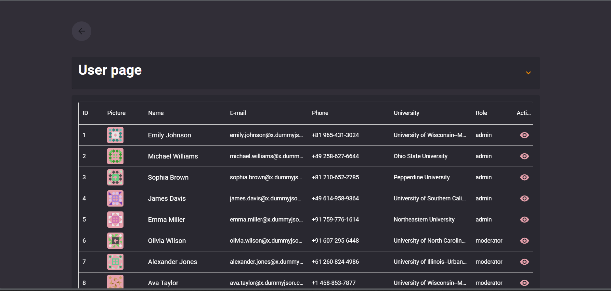

# Getting Started with Create React App

This project was bootstrapped with [Create React App](https://github.com/facebook/create-react-app).

## Available Scripts

In the project directory, you can run:

### `npm start`

Runs the app in the development mode.\
Open [http://localhost:3000](http://localhost:3000) to view it in your browser.

The page will reload when you make changes.\
You may also see any lint errors in the console.

### `Description of challenge`

`Eleos: Frontend developer exercise`

Create an application using minimum the following technologies:

- ReactJS: you can use something like create-react-app to skip all the boilerplate
- React-router
- Forms: react-hook-forms
- UI: MaterialUI
- Follow good practices, clean code, modularity and reusability

`Tasks page`

- A form to create tasks
- A list to display the tasks created
- You should be able to create/edit/remove tasks
- It should be responsive (mobile/desktop). Up to you how to display it in those view
ports

`Users page`
- Accessing /users should display all users that come in the response to this API call
https://dummyjson.com/users
- Click on a single user should take you to /users/:id and display the information about
the user. 
- Refreshing the page while on the /users/:id should still display the
information about the user (API call to get a single user:
https://dummyjson.com/users/[userId])

The UI is free for you to choose what’s best to display and how to display it

### Result

`Home Page`

To navigate to other pages

   

`Task Page`

   

`User Page`

   

`User details Page`

   

### Deployment
Link to app 
- [eleos](https://eleos-react.vercel.app/)

